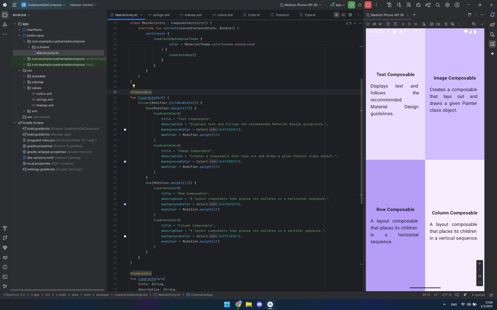

# ipdm-oto-2025--SantiagoFranco_ejercicio-3-c

## Descripción  
Aplicación Android desarrollada en Kotlin con Jetpack Compose que muestra una cuadrícula de 4 componentes.  
**Características**:  
- Cuatro cuadrantes con colores Material Design (`Color(0xFFEADDFF)`, etc.).  
- Textos centrados, negritas y padding de 16dp.  
- Uso de `Row`, `Column` y componentes reutilizables.  

## Captura de Pantalla  

